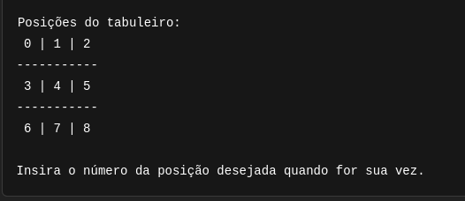
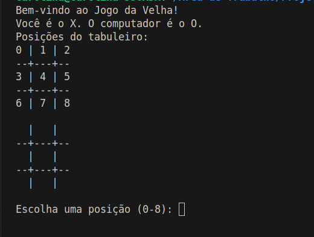
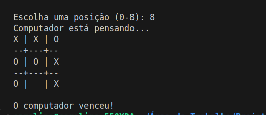

# 🧠 Jogo da Velha com Algoritmo Minimax

Este é um simples projeto de **Jogo da Velha (Tic-Tac-Toe)** desenvolvido em **Python**, onde o jogador humano enfrenta um oponente controlado por **inteligência artificial**, utilizando o **algoritmo Minimax**. O computador joga de forma ótima, sempre buscando vencer ou empatar.

---

## 🚀 Funcionalidades

- 🎮 Modo jogador vs computador
- 🧠 Computador joga estrategicamente com o algoritmo Minimax
- ✅ Detecta vitória, derrota ou empate
- ♻️ Código reutilizável, organizado e comentado
- 🧪 Pronto para testes e modificações

---


---

## 📌 Requisitos

- Python 3.6+
- Nenhuma biblioteca externa necessária

---

## ▶️ Como executar

1. Clone o repositório:

```bash
git clone https://github.com/carolcampos22/jogo-da-velha.git

cd jogo-da-velha-minimax

```
2. Entre na pasta do projeto:

```bash

cd jogo-da-velha

```

3. Execute o jogo:
```bash
#Linux ou macOS 
python3 minimax.py

#Windows
python3 minimax.py

```

## 📊 Como funciona o algoritmo Minimax?
O algoritmo Minimax simula todas as jogadas possíveis para o computador e o jogador. Ele atribui valores às jogadas de acordo com o resultado final:

- Vitória do computador ("O"): 10 - profundidade

- Vitória do jogador ("X"): -10 + profundidade

- Empate: 0

O computador sempre escolhe a jogada com o maior valor possível para ele.

---

## 🧩 Exemplos de jogadas
- O jogador sempre joga com "X"

- O computador joga com "O"



1. Início do Jogo:



2. Fim de Jogo



---

## ✍️ Autor

#### Desenvolvido por Carolina Mendes - Web Developer 💻